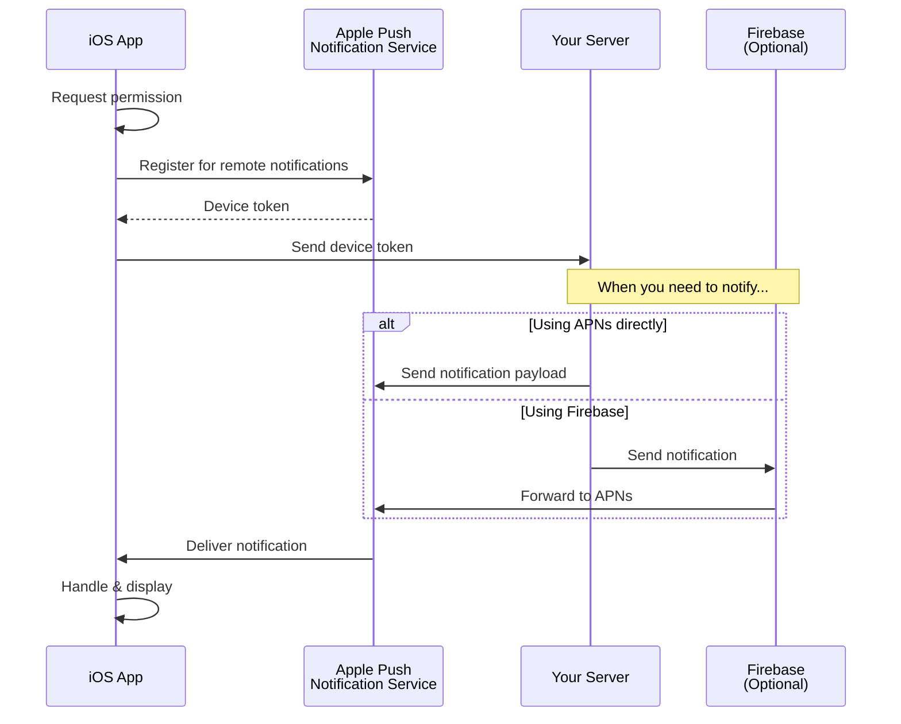

```
███╗   ██╗ ██████╗ ████████╗██╗███████╗██╗ ██████╗ █████╗ ████████╗██╗ ██████╗ ███╗   ██╗
████╗  ██║██╔═══██╗╚══██╔══╝██║██╔════╝██║██╔════╝██╔══██╗╚══██╔══╝██║██╔═══██╗████╗  ██║
██╔██╗ ██║██║   ██║   ██║   ██║█████╗  ██║██║     ███████║   ██║   ██║██║   ██║██╔██╗ ██║
██║╚██╗██║██║   ██║   ██║   ██║██╔══╝  ██║██║     ██╔══██║   ██║   ██║██║   ██║██║╚██╗██║
██║ ╚████║╚██████╔╝   ██║   ██║██║     ██║╚██████╗██║  ██║   ██║   ██║╚██████╔╝██║ ╚████║
╚═╝  ╚═══╝ ╚═════╝    ╚═╝   ╚═╝╚═╝     ╚═╝ ╚═════╝╚═╝  ╚═╝   ╚═╝   ╚═╝ ╚═════╝ ╚═╝  ╚═══╝
```

<div align="center">

[](https://swift.org)
[](https://developer.apple.com/ios/)
[](https://swift.org/package-manager/)
[](LICENSE)
[](https://github.com/muhittincamdali/iOS-Notification-Framework/actions)

**A comprehensive iOS notification framework supporting local, remote, rich media, and interactive notifications.**

[Features](#features) • [Installation](#installation) • [Quick Start](#quick-start) • [Documentation](#documentation)

</div>

---

## Features

| Type | Description | Capabilities |
|:----:|-------------|--------------|
| 🔔 **Local** | Schedule notifications locally | Time-based, location-based, calendar triggers |
| 📡 **Remote** | Push via APNs/Firebase | Background delivery, silent push, priority levels |
| 🎨 **Rich Media** | Attach images, video, audio | Thumbnails, GIFs, custom attachments |
| ⚡ **Actions** | Interactive buttons & input | Deep linking, text input, custom categories |

---

## How Push Notifications Work



---

## Installation

### Swift Package Manager

```swift
dependencies: [
    .package(url: "https://github.com/muhittincamdali/iOS-Notification-Framework.git", from: "1.0.0")
]
```

Or add via Xcode: **File → Add Package Dependencies** and paste the repository URL.

---

## Quick Start

### 1. Request Permission

```swift
import NotificationFramework

let manager = NotificationManager.shared

manager.requestAuthorization(options: [.alert, .sound, .badge]) { granted, error in
    if granted {
        print("Notifications enabled")
    }
}
```

### 2. Schedule a Local Notification

```swift
// Simple time-based notification
let content = NotificationContent(
    title: "Meeting Reminder",
    body: "Team standup in 5 minutes",
    sound: .default
)

manager.schedule(content, after: 300) // 5 minutes
```

### 3. Rich Media Notification

```swift
// Notification with image attachment
let richContent = RichNotificationContent(
    title: "New Photo",
    body: "Sarah shared a photo with you",
    imageURL: URL(string: "https://example.com/photo.jpg")!
)

richContent.category = "PHOTO_SHARE"
manager.schedule(richContent, at: Date().addingTimeInterval(60))
```

### 4. Interactive Actions

```swift
// Define actions
let likeAction = NotificationAction(
    identifier: "LIKE",
    title: "👍 Like",
    options: []
)

let replyAction = NotificationAction(
    identifier: "REPLY",
    title: "Reply",
    options: [.foreground],
    textInput: TextInputConfiguration(placeholder: "Type a message...")
)

// Create category
let category = NotificationCategory(
    identifier: "MESSAGE",
    actions: [likeAction, replyAction]
)

manager.registerCategories([category])

// Use in notification
let content = NotificationContent(
    title: "New Message",
    body: "Hey, are you free tonight?",
    categoryIdentifier: "MESSAGE"
)
```

---

## APNs Setup

### 1. Enable Push Notifications

1. Open your project in Xcode
2. Go to **Signing & Capabilities**
3. Click **+ Capability** → **Push Notifications**
4. Add **Background Modes** → Check **Remote notifications**

### 2. Create APNs Key

1. Go to [Apple Developer Portal](https://developer.apple.com/account/resources/authkeys/list)
2. Create a new key with **Apple Push Notifications service (APNs)**
3. Download the `.p8` file and note the Key ID

### 3. Register for Remote Notifications

```swift
import UIKit

class AppDelegate: UIResponder, UIApplicationDelegate {
    
    func application(_ application: UIApplication, 
                     didFinishLaunchingWithOptions launchOptions: [UIApplication.LaunchOptionsKey: Any]?) -> Bool {
        
        UNUserNotificationCenter.current().delegate = self
        application.registerForRemoteNotifications()
        return true
    }
    
    func application(_ application: UIApplication, 
                     didRegisterForRemoteNotificationsWithDeviceToken deviceToken: Data) {
        let token = deviceToken.map { String(format: "%02.2hhx", $0) }.joined()
        print("Device Token: \(token)")
        // Send token to your server
    }
    
    func application(_ application: UIApplication, 
                     didFailToRegisterForRemoteNotificationsWithError error: Error) {
        print("Failed to register: \(error)")
    }
}
```

---

## Firebase Cloud Messaging (Optional)

### 1. Install Firebase SDK

```swift
dependencies: [
    .package(url: "https://github.com/firebase/firebase-ios-sdk.git", from: "10.0.0")
]
```

### 2. Configure Firebase

```swift
import Firebase
import FirebaseMessaging

class AppDelegate: UIResponder, UIApplicationDelegate {
    
    func application(_ application: UIApplication, 
                     didFinishLaunchingWithOptions launchOptions: [UIApplication.LaunchOptionsKey: Any]?) -> Bool {
        
        FirebaseApp.configure()
        Messaging.messaging().delegate = self
        return true
    }
}

extension AppDelegate: MessagingDelegate {
    func messaging(_ messaging: Messaging, didReceiveRegistrationToken fcmToken: String?) {
        guard let token = fcmToken else { return }
        print("FCM Token: \(token)")
        // Send to your server
    }
}
```

---

## Advanced Scheduling

```swift
// Calendar-based trigger
let dateComponents = DateComponents(hour: 9, minute: 0, weekday: 2) // Every Monday at 9 AM
manager.schedule(content, matching: dateComponents, repeats: true)

// Location-based trigger
let region = CLCircularRegion(
    center: CLLocationCoordinate2D(latitude: 37.7749, longitude: -122.4194),
    radius: 100,
    identifier: "office"
)
region.notifyOnEntry = true
manager.schedule(content, entering: region)

// Batch scheduling
let notifications = [
    (content: reminder1, delay: 3600),
    (content: reminder2, delay: 7200),
    (content: reminder3, delay: 10800)
]
manager.scheduleBatch(notifications)
```

---

## Handling Notifications

```swift
extension AppDelegate: UNUserNotificationCenterDelegate {
    
    // Called when notification received in foreground
    func userNotificationCenter(_ center: UNUserNotificationCenter,
                                willPresent notification: UNNotification,
                                withCompletionHandler completionHandler: @escaping (UNNotificationPresentationOptions) -> Void) {
        completionHandler([.banner, .sound, .badge])
    }
    
    // Called when user taps notification
    func userNotificationCenter(_ center: UNUserNotificationCenter,
                                didReceive response: UNNotificationResponse,
                                withCompletionHandler completionHandler: @escaping () -> Void) {
        
        let actionIdentifier = response.actionIdentifier
        let userInfo = response.notification.request.content.userInfo
        
        switch actionIdentifier {
        case "LIKE":
            handleLikeAction(userInfo: userInfo)
        case "REPLY":
            if let textResponse = response as? UNTextInputNotificationResponse {
                handleReply(text: textResponse.userText, userInfo: userInfo)
            }
        default:
            handleNotificationTap(userInfo: userInfo)
        }
        
        completionHandler()
    }
}
```

---

## Requirements

| Component | Version |
|-----------|---------|
| iOS | 15.0+ |
| Swift | 5.9+ |
| Xcode | 15.0+ |

---

## Documentation

- [API Reference](Documentation/API.md)
- [Rich Media Guide](Documentation/RichMedia.md)
- [Scheduling Guide](Documentation/Scheduling.md)
- [Troubleshooting](Documentation/Troubleshooting.md)

---

## Contributing

Contributions are welcome! Please read our [Contributing Guide](CONTRIBUTING.md) before submitting a pull request.

---

## License

This project is licensed under the MIT License - see the [LICENSE](LICENSE) file for details.
